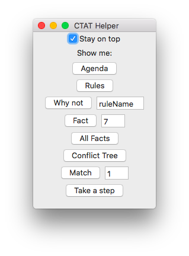

# CTATHelper
A hacky little helper app to send debugging JavaScript commands to Safari

## How this works

This Mac app written in Swift 4 is just a list of buttons.  Each button
executes some AppleScript.  The AppleScript tells Safari to run a JavaScript
command.  It should be easy to add such new commands.  Currently the commands
are basic CTAT Nools Model Tracer debugging commands, e.g.:

- Print agenda
- Print facts
- Print conflict tree
- Take a step

